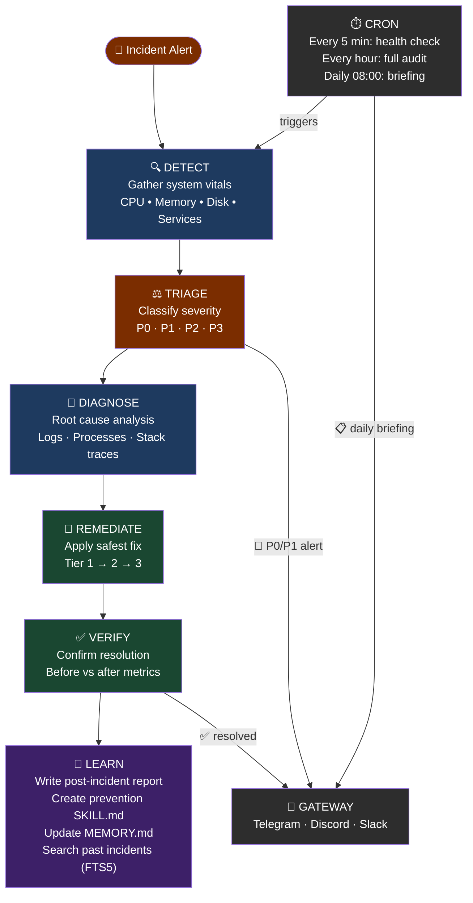
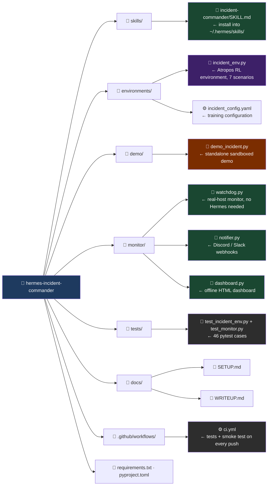
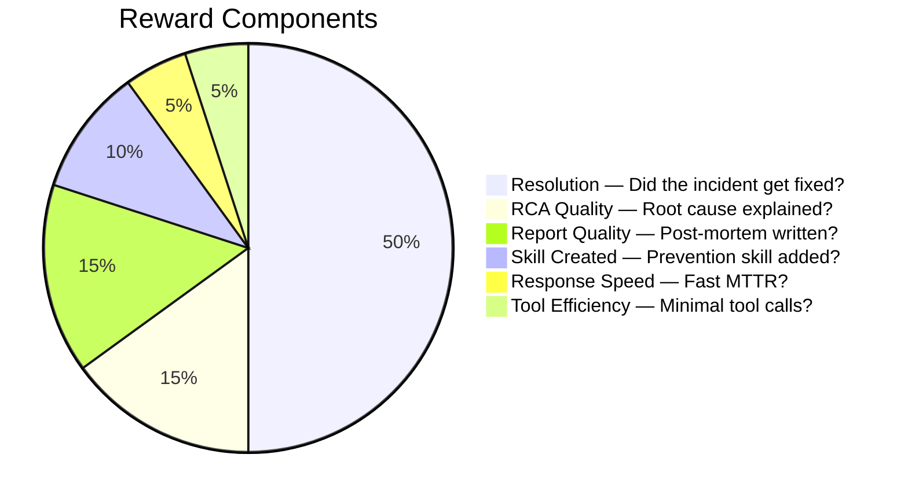

# ⚕ Hermes Incident Commander

[](https://github.com/Lethe044/hermes-incident-commander/actions/workflows/ci.yml)
[](LICENSE)
[](pyproject.toml)
[](CONTRIBUTING.md)

> **An autonomous SRE agent that detects, diagnoses, and heals production infrastructure - then learns from every incident it resolves.**

Originally built on [Hermes Agent](https://hermes-agent.nousresearch.com) by NousResearch
for the *"Show us what Hermes Agent can do"* hackathon. Now also ships a **standalone
watchdog** that runs on any real Linux host with nothing but an Anthropic API key —
no Hermes installation required.

---

## What's New

- 🛰️ **Standalone Watchdog** — monitor a real host's CPU/memory/disk and failed
  systemd units, get Claude-powered triage, and (opt-in) safe auto-remediation.
  No Hermes install needed. See [Standalone Mode](#standalone-mode-no-hermes-required).
- 📊 **Offline HTML Dashboard** — a single, dependency-free file summarizing your
  incident history. No server, no CDN, works offline.
- 📣 **Discord / Slack Notifier** — zero-dependency webhook alerts.
- 🧩 **2 new incident scenarios** — Docker crash-looping, network unreachability.
- ✅ **CI on every push** — the test suite and smoke test run automatically via
  GitHub Actions across Python 3.10–3.12.
- 🔒 **SAFETY.md** — a written threat model for the difference between demo mode
  (full shell access, sandbox only) and the watchdog's allow-listed remediation.

Full history in [CHANGELOG.md](CHANGELOG.md).

---

## The Problem

When a production server goes down at 3 AM, an on-call engineer has to:

1. Wake up, check alerts
2. SSH in, run diagnostics manually
3. Piece together root cause from logs
4. Apply a fix - hopefully the right one
5. Verify it worked
6. Write a post-mortem nobody will read

**Mean time to resolve (MTTR) for P0 incidents averages 45–60 minutes.** Much of that is humans doing things a sufficiently capable agent could do faster and better.

Hermes Incident Commander does all of it - autonomously, in minutes, getting smarter with each incident it handles.

---

## Demo

```bash
# Install dependencies
pip install anthropic rich

# Set your API key
export ANTHROPIC_API_KEY=sk-ant-...

# Run a demo incident (disk full scenario)
python demo/demo_incident.py --scenario disk-full-logs

# Try other scenarios
python demo/demo_incident.py --scenario svc-crash-nginx
python demo/demo_incident.py --scenario cpu-runaway-process
```

**What you'll see:**
- Hermes detects the incident and classifies severity (P0/P1/P2/P3)
- Runs parallel diagnostics across CPU, memory, disk, and services
- Identifies root cause with explicit reasoning
- Applies the safest effective fix
- Verifies the fix worked
- Writes a structured post-incident report to `~/.hermes/incidents/`
- Creates a **new prevention skill** in `~/.hermes/skills/` so it handles this faster next time

> ⚠️ The demo and the RL training environment give the model **full terminal
> access**. Only run them in a disposable sandbox/VM/container — see
> [SAFETY.md](SAFETY.md).

---

## Standalone Mode (No Hermes Required)

You don't need a Hermes Agent installation to get real value out of this
project. `monitor/watchdog.py` runs as an always-on process on any Linux host
and needs nothing but `ANTHROPIC_API_KEY`:

```bash
pip install -e .              # or: pip install -r requirements.txt psutil

export ANTHROPIC_API_KEY=sk-ant-...
# optional, for real-time alerts:
export DISCORD_WEBHOOK_URL=https://discord.com/api/webhooks/...
export SLACK_WEBHOOK_URL=https://hooks.slack.com/services/...

# Single check — good for testing or a cron job
python -m monitor.watchdog --once

# Continuous monitoring (observe-only by default)
python -m monitor.watchdog --cpu-threshold 85 --interval 30

# Opt in to SAFE, allow-listed auto-remediation (see monitor/watchdog_config.example.yaml)
python -m monitor.watchdog --config monitor/watchdog_config.yaml --auto-remediate
```

Unlike the demo/training environment, the watchdog **never gives the model
shell access**. It collects real metrics with `psutil`, sends only numbers to
Claude, and any remediation is restricted to an explicit allow-list you
configure (restart *this specific* service, clean *this specific* log
directory). Full threat model in [SAFETY.md](SAFETY.md).

Once you have some incident history, generate a dashboard:

```bash
python -m monitor.dashboard --open
```

This writes a single, self-contained HTML file (no server, no external
requests) summarizing incident counts by severity, auto-remediation rate, and
a recent-incidents table.

---

## How It Uses Every Hermes Feature

This project was designed to push every capability of Hermes Agent:

| Hermes Feature | How It's Used |
|---|---|
| **Persistent Memory** | Builds a system topology map over time. Learns which services fail together, time-of-day patterns, and which remediations work on YOUR infrastructure. |
| **Skill Auto-Creation** | After every novel incident, writes a new `SKILL.md` prevention playbook. Hermes gets measurably better at your stack over weeks. |
| **Cron Scheduler** | Every 5 min: critical health check. Every hour: full audit. Daily 08:00: morning briefing to Telegram. |
| **Gateway (Telegram/Discord)** | Real-time P0 alerts, resolution notices, and daily briefings delivered to your phone. |
| **Subagent Spawning** | For multi-service environments, spawns parallel subagents to investigate nginx, database, and application layers simultaneously. |
| **Session Search (FTS5)** | "Have we seen this error before?" - searches past incidents for matching patterns. |
| **execute_code** | Collapses multi-step diagnostic pipelines into single inference turns, dramatically reducing latency. |
| **MCP Integration** | Connects to cloud provider APIs (AWS/GCP/Azure MCP servers) for auto-scaling and cloud-native remediation. |

---

## Architecture



---

## Project Structure



---

## Installation (Full Hermes Setup)

### 1. Install Hermes Agent

```bash
curl -fsSL https://raw.githubusercontent.com/NousResearch/hermes-agent/main/scripts/install.sh | bash
```

### 2. Configure Hermes

```bash
hermes setup        # Interactive setup wizard
hermes model        # Choose your model (Nous Portal recommended)
hermes gateway setup  # Connect Telegram/Discord for alerts
```

### 3. Install the Incident Commander Skill

```bash
# Copy the skill to Hermes's skills directory
cp -r skills/incident-commander ~/.hermes/skills/

# Verify it's loaded
hermes
> /skills
```

### 4. Set Up Monitoring Cron Jobs

In your Hermes conversation:
```
Set up incident monitoring: run a health check every 5 minutes and alert me
on Telegram if anything is P0 or P1. Send me a daily briefing at 08:00.
```

Hermes will install the cron jobs automatically.

### 5. Run the RL Training Environment (Optional)

```bash
# Install Atropos
pip install atroposlib

# Generate SFT training data
python environments/incident_env.py process --config environments/incident_config.yaml

# Full RL training (requires VLLM)
python environments/incident_env.py serve --config environments/incident_config.yaml
```

---

## Reward Function (for RL Training)

The training environment uses a multi-component reward that captures real SRE quality:



---

## Incident Scenarios (Training Scenarios)

| ID | Severity | Category | Description |
|---|---|---|---|
| `svc-crash-nginx` | P0 | service | nginx crashed, website unreachable |
| `disk-full-logs` | P1 | disk | 95% disk usage from exploded log files |
| `memory-leak-process` | P1 | memory | Mystery process eating 150MB+ |
| `docker-container-crash` | P1 | docker | Container stuck in a restart/crash loop |
| `network-unreachable` | P1 | network | Upstream dependency unreachable, timeouts spiking |
| `cpu-runaway-process` | P2 | cpu | 95% CPU from runaway computation |
| `failed-systemd-unit` | P2 | service | Custom worker service in failed state |

---

## Running Tests

```bash
# Install test dependencies
pip install pytest pytest-asyncio psutil

# Fast sanity check, no dependencies beyond the stdlib + pyyaml
python environments/incident_env.py --smoke-test

# Run full test suite (46 tests: scenarios, reward function, skill file,
# demo script, notifier, watchdog, dashboard)
pytest tests/ -v

# Run specific test classes
pytest tests/test_incident_env.py::TestScenarioDefinitions -v
pytest tests/test_incident_env.py::TestRewardFunction -v
pytest tests/test_monitor.py::TestSafeRemediation -v
```

CI runs both of the above automatically on every push and PR across Python
3.10, 3.11, and 3.12 — see the badge at the top of this README or
[`.github/workflows/ci.yml`](.github/workflows/ci.yml).

---

## Why This Project Is Worth Using

1. **Real problem, real impact.** P0 incidents cost companies thousands of dollars per minute. Shaving 30 minutes off MTTR with an autonomous agent is immediately valuable.

2. **Uses every Hermes capability.** Memory, skills, cron, gateway, subagents, session search, execute_code - all integrated into a coherent, meaningful workflow.

3. **Self-improving.** The longer Hermes runs, the better it gets at your specific infrastructure. This is Hermes's core promise - "the agent that grows with you" - demonstrated concretely.

4. **Closes the training loop.** The Atropos RL environment means this isn't just a demo - it's a path to training models that are genuinely better at agentic SRE tasks.

5. **Works standalone, today, on a real host.** `monitor/watchdog.py` doesn't need Hermes at all — just `ANTHROPIC_API_KEY` — and is built with an explicit, documented safety model instead of giving an LLM raw shell access to your production box.

6. **Ships with working code and CI.** The demo runs standalone, 46 tests pass, GitHub Actions verifies every push, and the skill file installs in one command.

---

## Contributing

New incident scenarios, notifier integrations, and dashboard improvements are
welcome — see [CONTRIBUTING.md](CONTRIBUTING.md) for how to get set up and
what a good PR looks like.

## Safety

Please read [SAFETY.md](SAFETY.md) before pointing anything in this repo at
a machine you care about — demo mode and the watchdog have very different
risk profiles.

## License

MIT — see [LICENSE](LICENSE).

---

*Built with [Hermes Agent](https://hermes-agent.nousresearch.com) - the agent that grows with you.*
